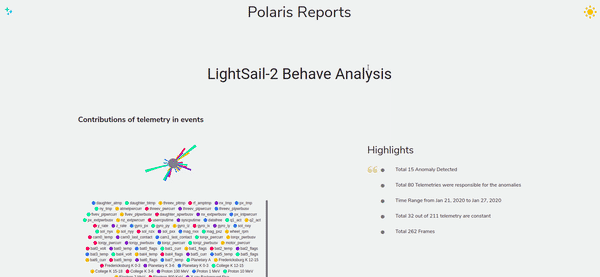
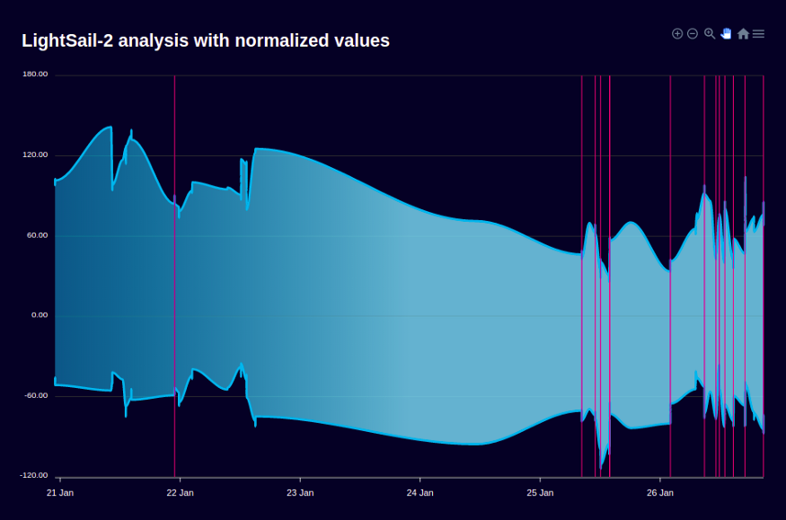
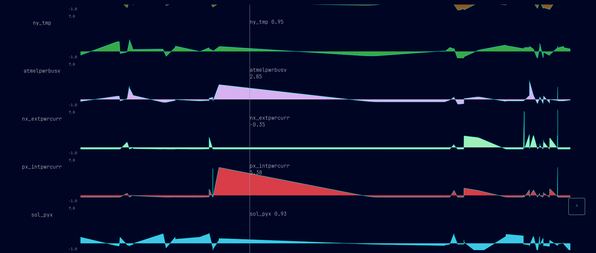

# Satellite Weather Impact Analysis

This repository contains the code for analyzing the impact of space weather on
active satellite systems. The analysis is performed by comparing solar and
active satellite data to identify correlations between them.

## Set up the Project

1. After cloning the repository, navigate to the root directory and download
   submodules recursively.
2. Create a new Conda environment with Python 3.8 and activate it.
3. In the project root, run the following command to install the required
   packages:

## Working with Polaris

Polaris configurations are located in the `cfg` folder. For more information,
refer to
the [Polaris ML Sandbox repository](https://gitlab.com/geugenm/polaris-ml-sandbox/-/tree/master?ref_type=heads).

1. From the root of the project, collect data and train on it with the following
   command:

```bash
polaris batch --config_file cfg/<satellite_config>.json
```

or fetch telemetry by manually specifying dates (polaris batch problem, cant specify dates in cfg file):

```bash
polaris fetch --cache_dir ./data/<sat_name>/cache --start_date 1970-01-01 --end_date 2024-03-25 <sat_name> ./data/<sat_name>/cache/normalized_frames.json
```

2. This will download all data into the `./data/<sat_name>` folder,
   where `sat_name` is specified in `cfg/polaris.json`.
3. Build the graph using the following command:

```bash
polaris viz ./data/<sat_name>/cache/graph.json
```

4. Detect anomalies in telemetry data using the `polaris behave` command:

```bash
polaris behave ./data/<sat-name>/cache/normalized_frames.json --output_file ./data/<sat_name>/cache/anomaly_analysis.json
```

5. Visualize anomaly detection using the `polaris report` command:

```bash
polaris report ./data/<sat_name>/cache/anomaly_analysis.json
```



6. (Optional) Convert the dependency graph to another file format using
   the `polaris convert` command:

```bash
polaris convert ./data/<sat_name>/cache/graph.json ./data/<sat_name>/cache/graph.gexf
```

7. (Optional) Information about the learning experiment with mlflow:

```bash
mlflow ui
```

## Features

- Loading and processing JSON data from SatNOGS Grafana Dashboard
- Converting timestamps to universal format
- Filtering data by specific years
- Calculating various types of correlations
- Plotting scatter plots for visualization
- Preprocessing solar and satellite data
- Merging datasets and performing correlation analysis

## Scripts Details

### Correlation Calculation

The script calculates several types of correlation coefficients between the
columns of the processed dataset. It uses the `pandas.DataFrame.corr()` method
to compute the Pearson correlation coefficients, which measure the linear
relationship between two datasets. Additionally, it computes the
Kendall Tau and Spearman rank correlation coefficients, which can capture
nonlinear relationships.

### Statistical Analysis

For each pair of columns being compared, the script calculates the Pearson
correlation, Kendall Tau, and Spearman rank correlation coefficients. It also
performs a Chi-square test of independence to determine if there is a
significant association between the two variables. The chi-square statistic and
the corresponding p-value are computed using `scipy.stats.chi2_contingency()`,
which provides insights into the likelihood that the observed data could have
occurred by chance under the assumption of no association.

### Visualizations

Scatter plots are generated for each pair of columns to visualize the
relationships between them. This helps in identifying trends and patterns in the
data. Heatmaps of correlation matrices can also be used to present the
correlation data in a more compact and informative manner.

<figure>
    
    <figcaption>An example of an anomaly in the data.</figcaption>
</figure>

<figure>
    
    <figcaption>An example of a data change over time.</figcaption>
</figure>

### Logging

The script logs important events and warnings during execution. For instance, if
a column is nearly constant and therefore not suitable for correlation analysis,
a warning is logged. All outputs are formatted professionally, with variables
enclosed in square brackets for clarity.

### Models

We are utilizing a modified and upgraded version
of [Polaris ML](https://gitlab.com/geugenm/polaris-ml-sandbox), enabling us to
use `Python 3.8` with the latest setup tools. This modification includes the
ability to
use polaris `behave` and `report`ing capabilities.
Additionally, Sun reports have been enabled, and some visualization styles have
been adjusted.

However, the graph functionality is still not fully operational. The graph can
be accessed by pressing `Ctrl + /`, it does display vertex names
correctly, but coloring is not available. As a workaround, exporting to [Gephi](https://gephi.org/) is the only
viable option at this time.

[Docs about `Polaris ML`](https://docs.polarisml.space/en/latest/using/getting_started_with_polaris.html#running-your-first-analysis-lightsail-2)

[More about eXtreme Gradient Boosting](https://www.wikiwand.com/en/XGBoost)

## Contributing

Pull requests and issues are welcome. For major changes, please open an issue
first to discuss what you would like to change.

## License

[GNU-GPL3.0](https://www.gnu.org/licenses/gpl-3.0.txt)