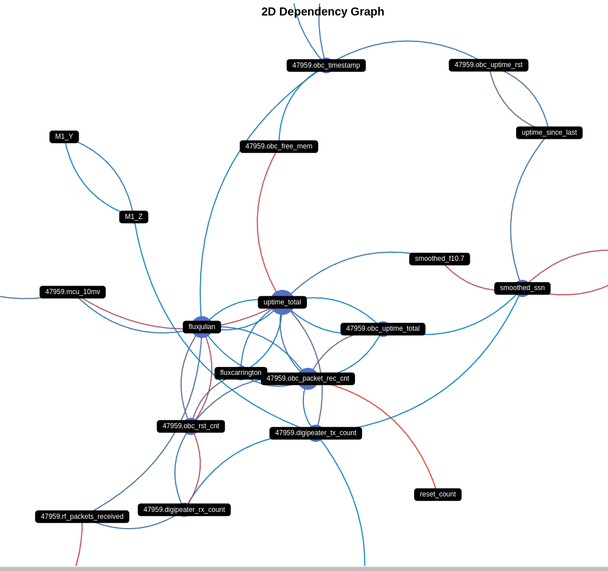

<div align="center">

# 🛰️ ASTRA: Satellite Weather Impact Analysis

[](https://github.com/geugenm/satellite-weather-impact-analysis/issues)
[](https://www.python.org/downloads/)
[](https://www.latex-project.org/)


[](license.md)

[](https://github.com/geugenm/satellite-weather-impact-analysis)

> _Advanced Space-Time Research & Analysis Platform_

</div>

## 🚀 Overview

ASTRA is a high-performance analytical platform designed to uncover correlations between space weather patterns and operational satellite systems. Using advanced statistical methods and machine learning techniques, we process vast amounts of solar and satellite telemetry data to identify critical patterns and dependencies.

## ⚡ Key Features

- **Real-time Analysis**: Process satellite telemetry data in real-time
- **ML-powered Insights**: Advanced correlation detection using machine learning
- **High Performance**: Optimized for large-scale data processing
- **Scientific Visualization**: Beautiful interactive graphs and dashboards

## 🛠️ Tech Stack

- **Core**: Python 3.13+, NumPy, Pandas
- **ML**: mlflow, xgboost, scikit-learn
- **Visualization**: Plotly, pyecharts, influxdb
- **Documentation**: LuaTeX, markdown, mermaid

## 📊 Preview



<div align="center">

## 🔗 Quick Links

[📚 Documentation](docs) •
[🐛 Report Bug](https://github.com/geugenm/satellite-weather-impact-analysis/issues/new?labels=bug&template=bug-report---.md) •
[✨ Request Feature](https://github.com/geugenm/satellite-weather-impact-analysis/issues/new?labels=enhancement&template=feature-request---.md)

---

</div>

## 🛠️ Getting Started

### 🐍 Prerequisites

Python Version

```bash
python --version
```

### ⚡ Quick Install

1. **Clone Repository**

```bash
git clone https://github.com/geugenm/satellite-weather-impact-analysis.git
cd satellite-weather-impact-analysis
```

2. **Install Dependencies**

Choose your preferred package manager:

**pip** (standard)

```bash
pip install -e ".[dev]"  # Unix/Windows
pip install -e '.[dev]'  # Zsh
```

**uv** (high performance)

```bash
uv pip install -e ".[dev]"
```

**poetry** (modern)

```bash
poetry install --with dev
```

> The `-e` flag enables editable mode - source changes reflect immediately

3. **Start docker compose**

```bash
sudo docker compose -f docker/compose.yml up
```

4. **Parse data**

Solar

```bash
mkdir data && cd data
mkdir sun && cd sun
python ../astra/fetch/sun/fluxtable.py
... # call other scripts in sun except data_processor.py
```

Satellite (example):

```bash
cd ..
python ../astra/fetch/satnogs_dashboard/main.py https://dashboard.satnogs.org/d/abEVHMIIk/veronika?orgId=1 -o veronika --from="-2y" --to="now"
```

5. Push to influx db (from docker container):

```bash
python ../astra/influxdb/loader.py ./sun --bucket="solar" --token="<your-influxdb-token>"
python ../astra/influxdb/loader.py ./veronika --bucket="veronika" --token="<your-influxdb-token>"
```

6. Analyze:

```bash
cd ..
python astra/analyzer.py veronika
```

### 🛰️ Satellite Data Tools

Using [satnogs-decoders](https://gitlab.com/librespacefoundation/satnogs/satnogs-decoders):

#### Fetch Satellite Frames

```
python ./satnogs-decoders/contrib/manage/fetch_frames_from_network.py \
    40967 \
    2018-10-26T00:00:00 \
    2018-10-26T01:00:00 \
    ./fox/
```

#### Decode Frames

```
decode_frame fox fox/data_XXXX
```

#### Push Data to InfluxDB (Local Docker from current repo after processing it)

1. Start the InfluxDB container using Docker Compose:

    ```
    sudo docker compose -f docker/compose.yml up
    ```

2. Push the decoded data to the InfluxDB bucket:

    ```
    influx write -b <bucket_name> -o <organization_name> -f ./fox/decoded_data.csv --token <your_token>
    ```

Replace `<bucket_name>`, `<organization_name>`, and `<your_token>` with your actual InfluxDB configuration values.

## 🤝 Contributing

We welcome contributions! For major changes:

1. Fork the repository
2. Create a feature branch
3. Open an issue for discussion
4. Submit a pull request

## 📜 License

Released under [MIT](license.md) by [@geugenm](https://github.com/geugenm)

<div align="center">

---

<sub>Built with 💫 by space enthusiasts</sub>

</div>
