<h1 align="center">Satellite Weather Impact Analysis</h1>

<div align="center">
  <div>
    <a href="https://github.com/geugenm/satellite-weather-impact-analysis/issues">
      
    </a>
    
    
    
  </div>
  <br />
  <a href="https://github.com/geugenm/satellite-weather-impact-analysis">
    
  </a>
  <h3 align="center">Satellite Weather Impact Analysis</h3>
  <p align="center">
    This repository includes the code for a study that examines the effects of space weather on operational satellite systems. The analysis involves comparing solar data with active satellite data to uncover correlations between the two.
    <br />
    <a href="https://github.com/geugenm/satellite-weather-impact-analysis/docs"><strong>Explore the docs »</strong></a>
    <br /><br />
    <a href="https://github.com/geugenm/satellite-weather-impact-analysis/issues/new?labels=bug&template=bug-report---.md">Report Bug</a>
    ·
    <a href="https://github.com/geugenm/satellite-weather-impact-analysis/issues/new?labels=enhancement&template=feature-request---.md">Request Feature</a>
  </p>
</div>

<!-- TABLE OF CONTENTS -->
<details>
  <summary>Table of Contents (click to reveal)</summary>
  <ol>
    <li>
      <a href="#about-the-project">About The Project</a>
      <ul>
        <li><a href="#built-with">Built With</a></li>
      </ul>
    </li>
        <li><a href="#prerequisites">Prerequisites</a></li>
        <li><a href="#installation">Installation</a></li>
    <li><a href="#contributing">Contributing</a></li>
    <li><a href="#license">License</a></li>
  </ol>
</details>


### Prerequisites

- python 3.13+

    ```sh
    python --version
    ```

- poetry

    ```sh
    poetry --version
    ```
### Prerequisites

python 3.11+
```sh
python --version
```

### Installation

1. Clone the repo

    ```shell
    git clone https://github.com/geugenm/satellite-weather-impact-analysis.git
    ```

2. To install development dependencies from pyproject.toml, use one of these commands:

```bash
pip install -e ".[dev]"
```

or if you're using uv (which is faster):

```bash
uv pip install -e ".[dev]"
```

For zsh users who might encounter quote issues, use:

```bash
pip install -e '.[dev]'
```

The -e flag makes it an "editable" install, which means changes in source files are immediately reflected without needing to reinstall.

#### Alternative Package Managers

**Poetry**:

```bash
poetry install --with dev
```

**uv**:

```bash
uv pip install --editable ".[dev]"
```
   ```shell
   git clone https://github.com/geugenm/satellite-weather-impact-analysis.git
   ```
2. Install pip requirements
   ```shell
   pip install -r requirements.txt
   ```

## Flow diagram (use mermaid previewer to see rendered)

```mermaid
flowchart TD
    A[🚀 Start Process] --> B[📡 Download Satellite Data from SatNOGS Grafana]
    B --> C[🛠️ Use Custom JS Parser to Extract Data]
    C --> D[🌞 Download Solar Data from Multiple Sources]
    
    D --> E{🔗 Data Sources}
    E -->|📊 SWPC Observed SSN JSON| F["services.swpc.noaa.gov/json/solar-cycle/swpc_observed_ssn.json"]
    E -->|📈 SIDC Total CSV| G["www.sidc.be/SILSO/INFO/sndtotcsv.php"]
    E -->|🌍 SIDC Hemispheric CSV| H["www.sidc.be/SILSO/INFO/sndhemcsv.php"]
    E -->|🌌 Daily Flux Values| I["spaceweather.gc.ca/solar_flux_data/daily_flux_values/fluxtable.txt"]
    
    D --> J[📥 Download DGD Data Using Vilnevilialli GitLab Package]
    
    J --> K[🔄 Merging Data into One Unified DataFrame]
    K --> L[🔍 Filter and Clean Data Based on Requirements]
    
    L --> M[🤖 Train XGBoost Polaris Machine Learning Model]
    
    M --> N[📊 Analyze Output Graphs of Data Relationships]
    
    N --> O[📈 Generate Correlation Graph to Visualize Dependencies]
    
    O --> P[🔬 Evaluate Model Performance in MLflow]
    
    P --> Q[🏁 End Process]

    %% Additional Explanation Nodes
    Q1[💡 How It Works: The process begins by downloading satellite data from SatNOGS, followed by solar data from various sources. The data is then merged and filtered for analysis.] 
    P1[🔍 Model Evaluation: The trained model's performance is analyzed using MLflow to ensure accuracy and reliability.]

    %% Connecting explanation nodes
    Q --> Q1
    P --> P1
```



## Observed Solar Cycle Indices

Data fields for recent solar indices of observed monthly mean values are provided in JSON format.

| Field                  | Description                                         |
|------------------------|-----------------------------------------------------|
| `time-tag`             | yyyy-mm                                            |
| `ssn`                  | Mean monthly S.I.D.C. sunspot number               |
| `smoothed_ssn`        | Smoothed S.I.D.C. sunspot number                   |
| `observed_swpc_ssn`   | Mean monthly SWPC/SWO sunspot number               |
| `smoothed_swpc_ssn`   | Smoothed SWPC/SWO sunspot number                   |
| `f10.7`                | Mean monthly Penticton, B.C. 10.7cm radio flux values (sfu) |
| `smoothed_f10.7`      | Smoothed 10.7cm radio flux values (sfu)           |

### Sources

- SWPC Space Weather Operations (SWO), Daily Observations
- S.I.D.C. Brussels International Sunspot Number, Data Files
- Penticton, B.C., Canada: 10.7cm radio flux values (sfu), Data Files

---

## Predicted Solar Cycle Indices

Data fields for sunspot number and radio flux values with expected ranges are provided in JSON format.

| Field                  | Description                                         |
|------------------------|-----------------------------------------------------|
| `time-tag`             | yyyy-mm                                            |
| `predicted_ssn`        | Predicted sunspot number                           |
| `high_ssn`             | Predicted sunspot number high range                |
| `low_ssn`              | Predicted sunspot number low range                 |
| `predicted_f10.7`      | Predicted f10.7cm value                            |
| `high_f10.7`          | Predicted f10.7cm high range                       |
| `low_f10.7`           | Predicted f10.7cm low range                        |

### Sources

- S.I.D.C. Brussels International Sunspot Number, Data Files
- Penticton, B.C., Canada: 10.7cm radio flux values (sfu), Data Files
- Predicted values are based on the consensus of the Solar Cycle 25 Prediction Panel.

---

## References

- [NOAA Solar Cycle Progression](https://www.swpc.noaa.gov/products/solar-cycle-progression)

---

## Contributing

Pull requests and issues are welcome! For significant changes, please open an issue first to discuss your ideas.

## License

Released under [GNU GPL](/license.md) by [@geugenm](https://github.com/geugenm).

Released under [GNU GPL](/license.md) by [@geugenm](https://github.com/geugenm)
