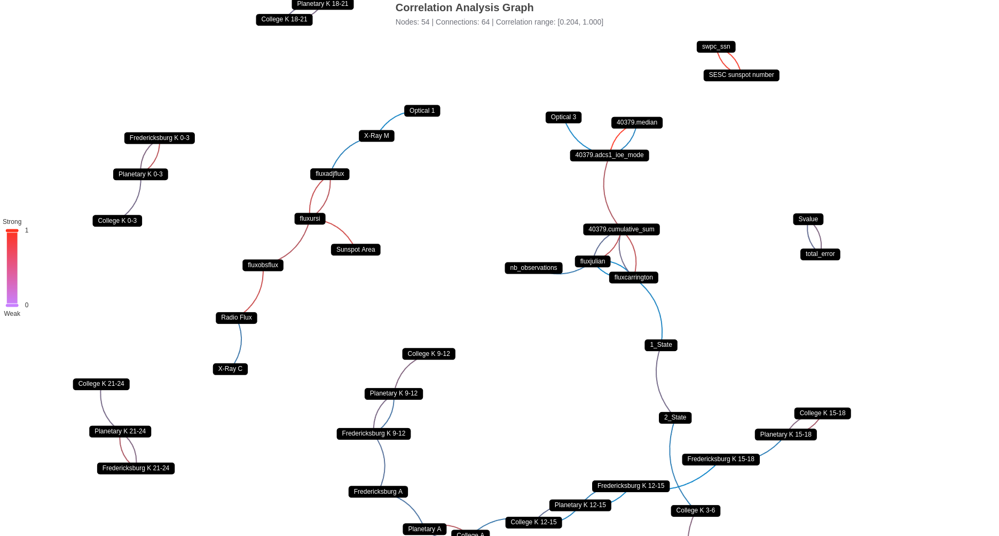

# astra satellite-weather-impact-analysis

<div align="center">

[](https://github.com/geugenm/satellite-weather-impact-analysis/issues)


[](https://github.com/geugenm/satellite-weather-impact-analysis)

This repository includes the code for a study that examines the effects of space weather on operational satellite systems. The analysis involves comparing solar data with active satellite data to uncover correlations between the two.

**[Explore the docs »](https://github.com/geugenm/satellite-weather-impact-analysis/docs)**

[Report Bug](https://github.com/geugenm/satellite-weather-impact-analysis/issues/new?labels=bug&template=bug-report---.md) ·
[Request Feature](https://github.com/geugenm/satellite-weather-impact-analysis/issues/new?labels=enhancement&template=feature-request---.md)

</div>



### Prerequisites

- python 3.13+

    ```sh
    python --version
    ```

### Installation

1. Clone the repo

    ```shell
    git clone https://github.com/geugenm/satellite-weather-impact-analysis.git
    ```

2. To install development dependencies from pyproject.toml, use one of these commands:

```bash
pip install -e ".[dev]"
```

or if you're using uv (which is faster):

```bash
uv pip install -e ".[dev]"
```

For zsh users who might encounter quote issues, use:

```bash
pip install -e '.[dev]'
```

The -e flag makes it an "editable" install, which means changes in source files are immediately reflected without needing to reinstall.

#### Alternative Package Managers

**Poetry**:

```bash
poetry install --with dev
```

**uv**:

```bash
uv pip install --editable ".[dev]"
```

### Additional instruments on decoding and obtaining satellite data

To fetch more data use [satnogs-decoders](https://gitlab.com/librespacefoundation/satnogs/satnogs-decoders), example:

```sh
satnogs-decoders-master/contrib/manage/fetch_frames_from_network.py 40967 2018-10-26T00:00:00 2018-10-26T01:00:00 ./fox1a/

decode_frame fox1a fox1a/data_XXXX
```

## Contributing

Pull requests and issues are welcome. For major changes, please open an issue
first to discuss what you would like to change.

## License

Released under [MIT](license.md) by [@geugenm](https://github.com/geugenm).
